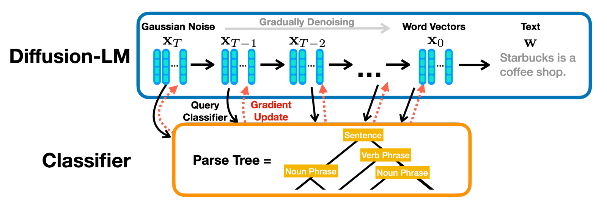

# Diffusion-LM

Figure from the original paper.

This is an unofficial implementation of [Diffusion-LM](https://arxiv.org/abs/2205.14217). For the official implementation, please refer [here](https://github.com/XiangLi1999/Diffusion-LM).

# :hammer_and_wrench: Setup
If you are using [poetry](https://github.com/python-poetry/poetry), run the following command to install required dependencies.
```bash
poetry install
```

Next, activate your virtual environment.
```bash
poetry shell
```

You can find more details about the required packages in `pyproject.toml`.

After that, initialize an [🤗Accelerate](https://github.com/huggingface/accelerate/) environment with:

```bash
accelerate config
```

Alternatively, you can set up a default Accelerate configuration without answering questions about your environment using:

```bash
accelerate config default
```


# :rocket: Run
## Diffusion-LM training
This repository allows you to train the Diffusion-LM on E2E datasets using the following commands.
```bash
accelerate launch scripts/train.py --expn foo
```

<details markdown="1">

<summary>Available arguments</summary>

- `--expn` (`-e`): The experimental name, which is used as the basename of the output directory. If this argument is not provided, the directory name is assigned based on the current time.
- `--wandb` (`-w`): Indicates whether to use the Weights & Biases tracker.

</details>

## Classifier Training for Plug-and-Play Control
This repository also supports the training of GPT2 classifiers for control by Semantic Content.
```bash
accelerate launch scripts/clf_train.py --output output/foo
```

<details markdown="1">

<summary>Available arguments</summary>

- `-o`, `--output`: The directory where the training results will be saved.
- `-mc`, `--model_ckpt` (default='checkpoints/pytorch_model_1.bin'): Path to the Diffusion-LM checkpoint (from the path specified in the `--output` argument).

</details>

## Sampling
### Conditional Sampling with Plug-and-Play Control
After training the Diffusion-LM and the GPT2 classifier, you can perform conditional sampling.
```bash
accelerate launch scripts/sample.py --output output/foo --control_label 'food : Japanese'
```

<details markdown="1">

<summary>Available arguments</summary>

- `-o`, `--output`: The directory where the training results will be saved.
- `-n`, `--n_samples` (default=16): The number of samples (used as batch size).
- `-mc`, `--model_ckpt` (default='checkpoints/pytorch_model_1.bin'): Path to the Diffusion-LM checkpoint (from the path specified in the `--output` argument).
- `-ud`, `--use_ddpm` (default=False): Whether to use DDPM sampling (the default is DDIM).
- `-cc`, `--clf_ckpt` (default='classifier/pytorch_model.bin'): Path to the classifier checkpoint (from the path specified in the output argument).Path to the classifier checkpoint (from the path specified in the `--output` argument).
- `-cl`, `--control_label` (default=None): Label for plug-and-play control.

</details>

### Unconditional Sampling
For unconditional sampling, it's only necessary to train the Diffusion-LM (there's no need to train the GPT2 classifier).classifier).
```bash
accelerate launch scripts/sample.py --output output/foo
```

---

If you find this repository helpful, please consider giving a star :star:!
